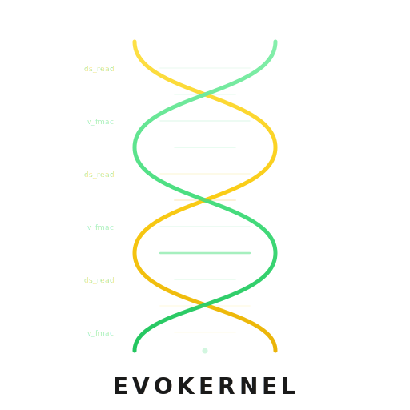

<p align="center">
  
</p>

# EvoKernel: AI reads 10 GPU kernels, beats the hand-tuned best

AI-assisted GPU kernel optimization for 3D depthwise convolution on AMD MI350X.

**Result**: PyTorch 5.8ms &rarr; hand-tuned 0.61ms &rarr; AI-optimized 0.54ms (10.7x faster than PyTorch)

Presentation: https://sammysun0711.github.io/EvoKernel

## The Setup: What AI Was Given

| Input | Purpose |
|---|---|
| [`task.md`](task.md) | Problem definition: 3D depthwise conv shapes, PyTorch reference code |
| [`gpu_arch/`](gpu_arch/) | Hardware specs: CDNA3/4 ISA, LDS sizes, instruction throughput |
| [`profiling/`](profiling/) | Profiling tools: `rocprofv3` for PMC counters + instruction-level thread trace |
| [`pyhip/`](pyhip/) | Toolkit: compile and launch HIP C++ kernels from Python |
| Reference kernels | Human shows well-optimized kernels (hipconv, paged attention, fused MLP) as learning material |

The human provides context **declaratively** ("read this kernel, study it") rather than imperatively ("use technique X"). The human owns final verification: correctness against PyTorch and reproducible timing.

## The Problem

3D depthwise convolution on AMD Instinct MI350X (CDNA4 / gfx950):

```
Input:   [1, 512, 61, 45, 80]  bf16     (NCHW)
Weight:  [512, 1, 3, 5, 5]     bf16     (depthwise: groups=512)
Output:  [1, 512, 59, 45, 80]  bf16
Padding: (0, 2, 2)  Stride: (1,1,1)     GFLOPs: 16.31
```

Each output pixel requires 75 multiply-accumulate operations (3x5x5 filter).

## The Optimization Journey &mdash; 5 Steps

### Step 1: Naive Baseline (5.1ms)

[`kernels/step1_naive.cpp`](kernels/step1_naive.cpp) &mdash; 95 lines

One thread computes one output pixel. Each thread independently reads 75 input values and 75 weights from global memory, with boundary checks per tap.

```
Thread 0:  global_load input[0..74] + weight[0..74] -> accumulate -> global_store output[0]
Thread 1:  global_load input[1..75] + weight[0..74] -> accumulate -> global_store output[1]
  ...no data sharing between threads
```

AI reads `gpu_arch/quick_reference.md` to understand the memory hierarchy: global memory is slow (~500 cycles), LDS is fast (~50 cycles), registers are instant.

### Step 2: NHWC Memory Layout (1.17ms &mdash; 5x faster)

[`kernels/step2_nhwc.cpp`](kernels/step2_nhwc.cpp) &mdash; 120 lines

Rearrange data to NHWC layout so adjacent threads access adjacent channels &mdash; coalesced global memory reads. Each thread handles 8 channels at one spatial position.

```
Thread 0:  channels [0..7]    at spatial position S   <- adjacent in memory
Thread 1:  channels [8..15]   at spatial position S   <- coalesced 128-byte read
  ...
Thread 63: channels [504..511] at spatial position S
```

**Lesson**: Coalescing gives 5x, but each thread still reads 75 values independently from global memory. No data reuse across threads. For large filters (75 taps), **data reuse matters more than memory layout**.

### Step 3: NCHW + LDS Cache (0.62ms &mdash; 9.4x faster)

[`kernels/step3_nchw_lds.cpp`](kernels/step3_nchw_lds.cpp) &mdash; 242 lines

Switch back to NCHW layout. 256 threads cooperatively load the input tile into LDS (Local Data Share, 160KB per CU on MI350X), then each thread reads from fast LDS instead of slow global memory. Weights cached in 75 float VGPRs.

```
Phase 1:  256 threads cooperatively load input [3x49x84] into LDS    (once)
Phase 2:  Each thread loads 75 weights into registers                 (once)
Phase 3:  Each thread reads 45 ds_read_b32 from LDS + 150 v_fmac     (per output pair)
```

AI uses `rocprofv3` to profile this kernel. Thread trace reveals the instruction mix:
- 33.6% multiply-accumulate (v_fmac) &mdash; the actual compute
- 20.6% bf16 extraction (v_and, v_lshlrev) &mdash; unpacking packed bf16 pairs
- 13.3% NOPs &mdash; pipeline bubbles

This is the **production-quality hand-tuned kernel**.

### Step 4: MFMA Matrix Engine (14.4ms &mdash; failure!)

[`kernels/step4_mfma.cpp`](kernels/step4_mfma.cpp) &mdash; 277 lines

AI studied the `hipconv` grouped convolution library and found the **Toeplitz matrix + MFMA** technique: reformulate the width convolution as a matrix multiply and use the GPU's dedicated matrix engine (`v_mfma_f32_4x4x4f16`, batch=16) to process 16 channels simultaneously.

```
Toeplitz matrix for KW=5 (4 outputs from 8 inputs):
  m=0: [g0, g1, g2, g3, g4,  0,  0,  0]
  m=1: [ 0, g0, g1, g2, g3, g4,  0,  0]
  m=2: [ 0,  0, g0, g1, g2, g3, g4,  0]
  m=3: [ 0,  0,  0, g0, g1, g2, g3, g4]
```

Produces correct results but is **6x slower** than Step 3.

**Why it failed**: For depthwise conv (1 channel per group), the compute-to-data ratio is too low. Loading 16 channels' input into LDS costs 16x more, but MFMA compute only speeds up 16x at best &mdash; net zero. With only 64 threads (1 wave for MFMA), cooperative LDS loading is 4x slower than Step 3's 256 threads.

**Lesson**: MFMA is powerful for grouped conv (channels per group &ge; 4) but not for depthwise conv. Not every clever idea works &mdash; the failure teaches **when** a technique applies.

### Step 5: `sched_group_barrier` (0.54ms &mdash; 10.7x faster, the breakthrough)

[`kernels/step5_sgb.cpp`](kernels/step5_sgb.cpp) &mdash; 335 lines

AI read `fused_mlp.py` (a Triton+Gluon fused MLP kernel) and found the `sched_group_barrier` technique: compiler hints that force LLVM's instruction scheduler to interleave LDS reads with VALU compute, instead of batching all reads together then all computes.

Two changes from Step 3:

**1. Row-level read-compute interleaving:**
```
Step 3 (batch all reads, then all compute):
  ds_read x 45           <- read ALL 15 filter rows at once (45 VGPRs)
  s_waitcnt lgkmcnt(0)   <- wait for all
  v_fmac x 150           <- compute all

Step 5 (read one row, compute it, repeat):
  for each of 15 filter rows:
    ds_read x 3           <- read ONE row (3 VGPRs, reused)
    s_waitcnt lgkmcnt(0)  <- wait for just these 3
    v_fmac x 10           <- compute this row immediately
```

**2. Compiler scheduling hints:**
```cpp
__builtin_amdgcn_sched_group_barrier(0x0100, 3, 0);  // schedule 3 DS_read
__builtin_amdgcn_sched_group_barrier(0x0002, 10, 0);  // then 10 VALU
```

Without the hint, LLVM groups all similar instructions together (all reads, then all compute). The hint forces interleaving, allowing the 52-cycle `ds_read` latency to overlap with `v_fmac` execution.

| Metric | Step 3 | Step 5 |
|---|---|---|
| VGPRs | 155 | 86 |
| Occupancy | 3 waves/SIMD | 5 waves/SIMD |
| Time | 0.62ms | 0.54ms |
| vs PyTorch | 9.4x | **10.7x** |

Results are **bitwise identical** to Step 3 &mdash; same algorithm, better scheduling.

## How AI Uses Architecture Docs and Profiling

The optimization journey is driven by **measurement, not guessing**:

| Tool | What AI learns | Example |
|---|---|---|
| `gpu_arch/quick_reference.md` | Roofline analysis: memory or compute bound? | 16 GFLOPs / 8 TB/s = memory bound |
| `rocprofv3 --pmc` | Hardware counters: bank conflicts, LDS utilization | SQ_LDS_BANK_CONFLICT < 0.1% &rarr; not the bottleneck |
| `rocprofv3 --att` | Thread trace: per-instruction stall/idle breakdown | 33.6% FMA, 20.6% extraction &rarr; target extraction overhead |
| `gpu_arch/cdna4/README.md` | LDS = 160KB per CU (not 64KB!) | Changes occupancy calculation entirely |
| ISA PDF | Instruction encoding, MFMA lane mapping | Verified `v_mfma_f32_4x4x4f16` empirically on hardware |

## How AI Found What Humans Missed

The Step 5 breakthrough came from **cross-codebase learning**:

1. Human said: *"read `fused_mlp.py` to get optimization ideas"*
2. AI found `_amd_iglp_sched_group_barrier` used to interleave VMEM reads with MFMA compute
3. AI recognized the same principle applies: interleave **DS reads** with **VALU** in our conv kernel
4. AI implemented it in HIP C++ with `__builtin_amdgcn_sched_group_barrier`
5. The same interleaving idea had been tried earlier in a JIT kernel (Phase 11) but failed &mdash; the JIT lacked compiler scheduling hints

The pattern: **technique X works in kernel A &rarr; does it apply to kernel B?** AI can read many kernels and make these connections faster than a human engineer working on a single kernel.

## Human-AI Collaboration Workflow

**Human's role** (declarative, not imperative):
- Defines the problem ([`task.md`](task.md)) and provides hardware reference ([`gpu_arch/`](gpu_arch/))
- Shows examples of well-optimized kernels: *"read this hipconv code"*, *"check this fused_mlp"* &mdash; points to good work, doesn't prescribe what to extract
- Challenges AI's claims: *"where's the source for that?"* &rarr; forces tracing to primary data
- Owns final verification: correctness against PyTorch, reproducible timing

**AI's role** (autonomous within scope):
- Reads architecture docs and ISA references at scale
- Studies reference kernels, extracts techniques, applies them to the target kernel
- Proposes, implements, and benchmarks kernel variants
- Self-corrects when evidence contradicts assumptions

**Key collaboration moments:**

| Human says | AI does | Outcome |
|---|---|---|
| *"Read hipconv group_conv"* | Extracts Toeplitz+MFMA technique | Step 4: correct but 6x slower (learned why) |
| *"Read fused_mlp.py"* | Extracts `sched_group_barrier` | Step 5: 14% breakthrough |
| *"Where did you find LGKM queue overflow?"* | Traces to `vm_cnt.md` &mdash; it was a guess | Corrected: unverified claim removed |
| *"What is actual LDS size?"* | Queries `rocminfo` | Found 160KB (not 64KB), fixed occupancy analysis |

## The Self-Correction Story

During the project, AI made confident claims that turned out to be wrong. The human challenged them, and AI traced each claim to its source:

**1. LDS size**: AI assumed 64KB per CU (copied from CDNA3 docs). Human asked AI to verify. `rocminfo` showed MI350X has **160KB** &mdash; 2.5x larger. This changed the entire occupancy analysis.

**2. LGKM queue overflow**: AI claimed *"16-entry LGKM queue overflows when batching 45 ds_reads."* Human asked *"where's the source?"* AI traced to `vm_cnt.md` which confirmed VMEM has a 64-entry queue but only **guessed** LDS works similarly, noting *"that causes no stall most-likely."* The LDS queue depth was never tested.

**3. Compiler occupancy**: Compiler reported occupancy 5 for Step 5. AI initially presented this as runtime occupancy. Analysis showed the compiler only reports the VGPR limit (`floor(512/86) = 5`) &mdash; LDS constraints are enforced at runtime. On MI350X with 160KB LDS, both VGPR and LDS converge at 5, so the reported number happened to be correct.

**Lesson**: Honest engineering requires tracing claims to primary sources. AI + human skepticism catches errors that either alone would miss.

## Results
All kernels produce correct results (calc_diff ~4e-6 vs PyTorch BF16 reference):
```
GPU:     AMD Instinct MI350X
Input:   [1, 512, 61, 45, 80] bf16
Weight:  [512, 1, 3, 5, 5] bf16
Output:  [1, 512, 59, 45, 80] bf16

CORRECTNESS vs PyTorch F.conv3d: all PASS (calc_diff ~4e-6)

Kernel                  Time (ms)  vs PyTorch
-----------------------------------------------
PyTorch                    5.81        1.0x
Step1: Naive               5.14        1.1x
Step2: NHWC                1.17        5.0x
Step3: NCHW+LDS            0.62        9.4x
Step4: MFMA               14.40        0.4x   <- failure (correct but slow)
Step5: SGB                 0.54       10.7x   <- AI's breakthrough
```

## Reproduce

```bash
cd EvoKernel
bash demo.sh              # default: 100 iterations
bash demo.sh --iters 200  # more stable timing
```

Requires: AMD MI300X/MI350X, ROCm, PyTorch with ROCm support.

## Repo Structure

```
EvoKernel/
  kernels/
    step1_naive.cpp          # 1 thread = 1 output, global memory
    step2_nhwc.cpp           # NHWC coalesced channels, no data reuse
    step3_nchw_lds.cpp       # NCHW + cooperative LDS cache (hand-tuned best)
    step4_mfma.cpp           # MFMA Toeplitz matrix engine (failure)
    step5_sgb.cpp            # sched_group_barrier + row-interleave (AI's best)
  benchmark.py               # Benchmark all 5 steps + PyTorch
  demo.sh                    # One-command reproduction
  task.md                    # Problem definition given to AI
  gpu_arch/                  # Hardware specs (source of truth)
  profiling/                 # rocprofv3 scripts for PMC + thread trace
  pyhip/                     # Minimal kernel compiler/launcher
  optimization_trajectory.md # Full 12-phase technical deep dive (1000+ lines)
```

## Key Takeaways

1. **Ground truth beats generic GPU lore.** If the hardware isn’t in the prompt, the model will still sound sure—treat **hardware specifications** and **architecture / ISA documentation** as the source of truth.

2. **Build fast; measure deeper than the stopwatch.** Rapid iteration plus real observability with trusted tools—not just end-to-end time—turns guesses into evidence.

3. **Humans own the task, the benchmark, and the verdict.** Define correctness and performance bars; only people sign off on what “done” means.

4. **Map the docs; don’t flood the context.** An index and layered reading paths beat one enormous file agents must swallow whole.

5. **Remember the lesson, not every dead end.** Capture what worked and what failed—then distill and drop noise so the trail stays sharp.


## Deep Dive

The full 12-phase optimization journey &mdash; including assembly patching, JIT rewrites, 6 LDS optimization variants, and all the dead ends &mdash; is documented in [`optimization_trajectory.md`](optimization_trajectory.md).
